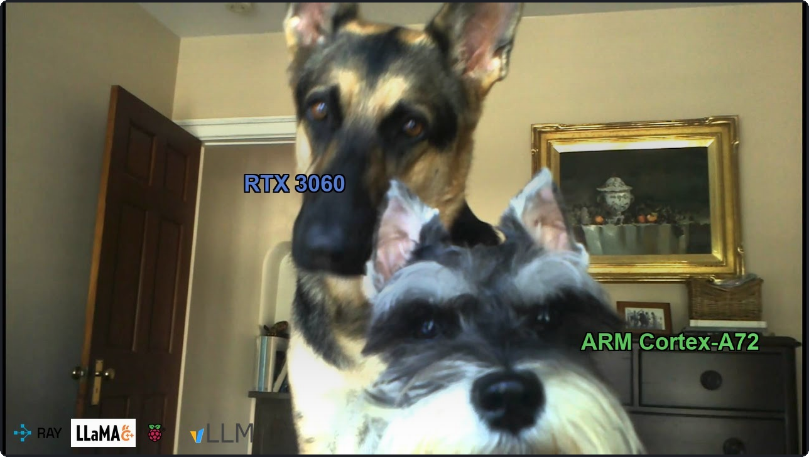
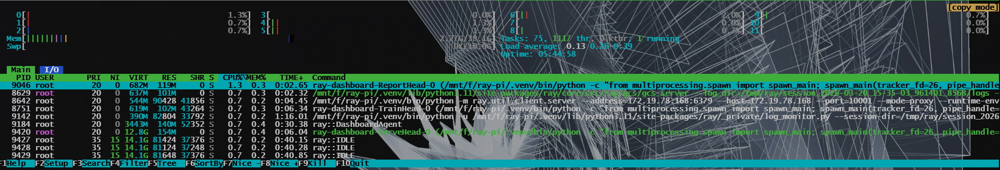
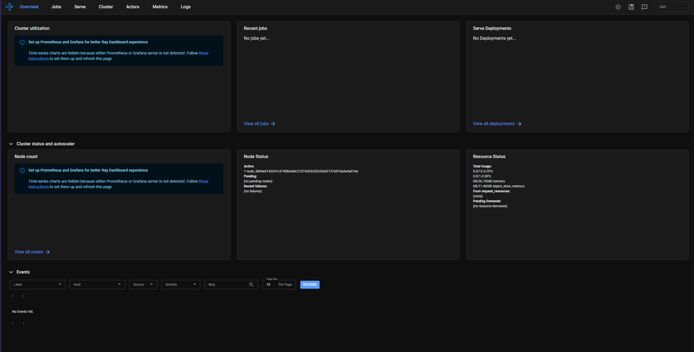
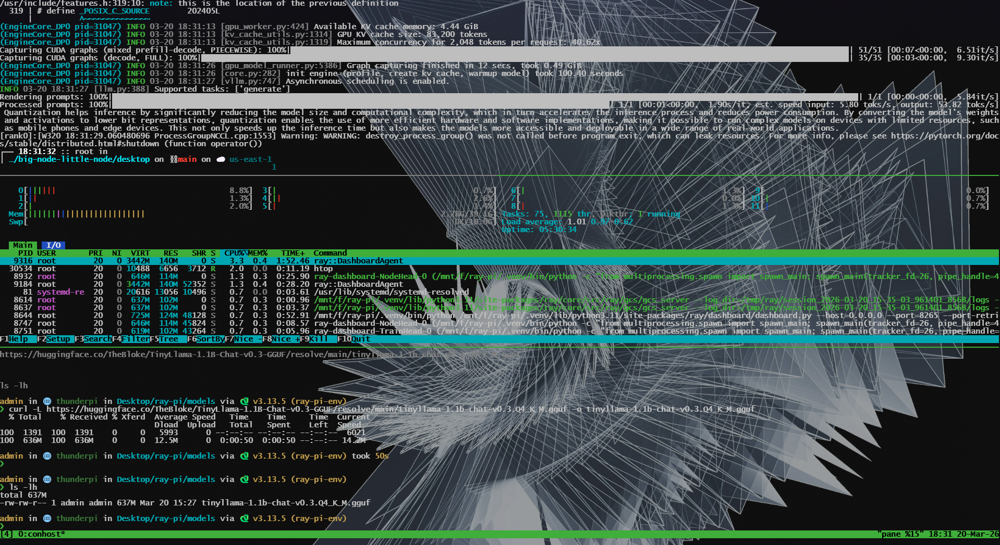
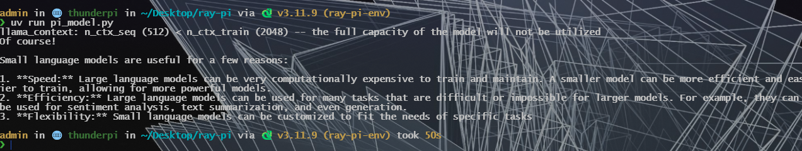
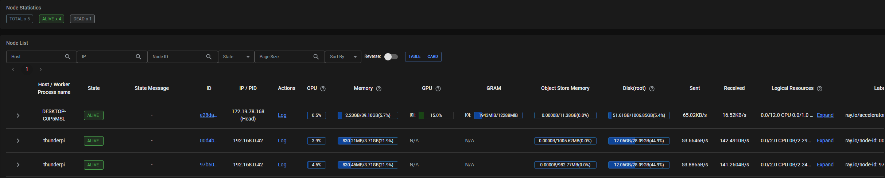

<a id="readme-top"></a>

<p align="center">
  
  <br/>
  <sub>Banner adapted from <a href="https://www.youtube.com/watch?v=VkzgX7lCpH0">Asking my german shepherd and mini schnauzer a question</a> by jimintustin</sub>
</p>

<h3 align="center">Big Node Little Node</h3>

<p align="center">
  Distributed ML inference across a desktop RTX 3060 and a Raspberry Pi 4B, connected with Ray.
  <br /><br />
  
  &nbsp;
  
  &nbsp;
  
  &nbsp;
  
</p>

---

<details>
  <summary>Table of Contents</summary>
  <ol>
    <li><a href="#quickstart">Quickstart</a></li>
    <li><a href="#hardware-os">Hardware &amp; OS</a></li>
    <li><a href="#networking">Networking</a></li>
    <li><a href="#choosing-a-model">Choosing a Model</a></li>
    <li>
      <a href="#distributed-setup-wsl-desktop---raspberry-pi">Distributed Setup</a>
      <ul>
        <li><a href="#wsl-networking-note">WSL Networking Note</a></li>
        <li><a href="#wsl-desktop---rtx-3060">Desktop (WSL - RTX 3060)</a></li>
        <li><a href="#raspberry-pi-arm-cortex-a72">Raspberry Pi (ARM Cortex-A72)</a></li>
      </ul>
    </li>
    <li><a href="#configuration">Configuration</a></li>
    <li><a href="#notes">Notes</a></li>
  </ol>
</details>

---

We start with a few goals, starting with simple scaffolding, serving and testing the models. These may/will expand. I will document the steps taken and choices, so you can do the same for your machines.

### Gotchas
> - n.b. I use zsh not bash - adjust `.zshrc` references to `.bashrc` as needed
> - **WSL users:** Ray binds to the WSL internal IP (`172.x.x.x`) which the Pi cannot reach. Either use a native Linux/Windows Python env (recommended), or set up port forwarding - see the [WSL networking note](#wsl-networking-note) below.
> - **Python versions must match across all Ray nodes.** Use pyenv to pin 3.11.9 on both desktop and Pi.

### Goals:
- [x] We want to use Ray to run two models on some consumer hardware:
  - A desktop PC 
  - A Raspberry Pi 4B

- [x] Output text and render on in each terminal 
- [ ] Connect webui and try each model

- [ ] Rig the models to converse with each other and have a conversation about a topic

## Quickstart

Clone the repo and copy the config:

```bash
git clone https://github.com/jaedmunt/big-node-little-node
cd big-node-little-node
cp .env.example .env  # then fill in your model paths
```

**Desktop (WSL)** - install deps and start the Ray head:

```bash
python -m venv .venv && source .venv/bin/activate
pip install "ray[default]" vllm llama-cpp-python
ray start --head --port=6379 --dashboard-host=0.0.0.0
```

**Raspberry Pi** - install deps and join the cluster:

```bash
curl -LsSf https://astral.sh/uv/install.sh | sh && exec zsh
uv venv ~/Desktop/ray-pi/ray-pi-env --python 3.11
source ~/Desktop/ray-pi/ray-pi-env/bin/activate
uv pip install "ray[default]"==2.54.0 llama-cpp-python
ray start --address='DESKTOP_LAN_IP:6379' --num-cpus=2 --resources='{"pi": 1}'
```

**Run:**

```bash
# on desktop
python main.py
```

> See [Distributed Setup](#distributed-setup-wsl-desktop---raspberry-pi) for full install steps and [Configuration](#configuration) for `.env` details.

<p align="right">(<a href="#readme-top">back to top</a>)</p>

## Hardware, OS

**[Raspberry Pi 4B](https://www.raspberrypi.com/products/raspberry-pi-4-model-b/)**
- Raspberry Pi OS (Debian GNU/Linux 13, trixie) · aarch64
- Broadcom BCM2711, Quad core Cortex-A72 (ARM v8) @ 1.8GHz
- 4GB LPDDR4-3200 · 28GB storage

<details>
<summary>Full specs + fastfetch</summary>


```text
Broadcom BCM2711, Quad core Cortex-A72 (ARM v8) 64-bit SoC @ 1.8GHz
1GB, 2GB, 4GB or 8GB LPDDR4-3200 SDRAM (depending on model)
2.4 GHz and 5.0 GHz IEEE 802.11ac wireless, Bluetooth 5.0, BLE
Gigabit Ethernet
2 USB 3.0 ports; 2 USB 2.0 ports.
Raspberry Pi standard 40 pin GPIO header
2x micro-HDMI® ports (up to 4kp60 supported)
Micro-SD card slot for loading operating system and data storage
5V DC via USB-C connector (minimum 3A*)
Operating temperature: 0 - 50 degrees C ambient
```

```bash
        _,met$$$$$gg.          admin@thunderpi
     ,g$$$$$$$$$$$$$$$P.       ---------------
   ,g$$P""       """Y$$.".     OS: Debian GNU/Linux 13 (trixie) aarch64
  ,$$P'              `$$$.     Host: Raspberry Pi 4 Model B Rev 1.4
',$$P       ,ggs.     `$$b:    Kernel: Linux 6.12.62+rpt-rpi-v8
`d$$'     ,$P"'   .    $$$     Uptime: 1 hour, 35 mins
 $$P      d$'     ,    $$P     Packages: 1712 (dpkg)
 $$:      $$.   -    ,d$$'     Shell: zsh 5.9
 $$;      Y$b._   _,d$P'       Display (DSI-1): 800x480 @ 60 Hz in 7"
 Y$$.    `.`"Y$$$$P"'          WM: labwc (Wayland)
 `$$b      "-.__               CPU: BCM2711 (4) @ 1.80 GHz
  `Y$$b                        GPU: Broadcom bcm2711-vc5 [Integrated]
   `Y$$.                       Memory: 387.95 MiB / 3.71 GiB (10%)
     `$$b.                     Disk (/): 10.47 GiB / 28.09 GiB (37%) - ext4
       `Y$$b.                  Locale: en_GB.UTF-8
         `"Y$b._
             `""""
```

</details>

**Desktop PC** - home build
- Windows 11 + WSL (Arch Linux)
- Intel Core i5-10500 (12) @ 3.10GHz
- NVIDIA GeForce RTX 3060 (12GB VRAM) · 39GB RAM

<details>
<summary>fastfetch</summary>

```bash
                  -`                     root@DESKTOP-C0P5MSL
                 .o+`                    --------------------
                `ooo/                    OS: Arch Linux x86_64
               `+oooo:                   Kernel: Linux 6.6.87.2-microsoft-standard-WSL2
              `+oooooo:                  Uptime: 1 hour, 10 mins
              -+oooooo+:                 Packages: 829 (pacman)
            `/:-:++oooo+:                Shell: zsh 5.9
           `/++++/+++++++:               Display (XWAYLAND0): 2560x1440, 60 Hz
          `/++++++++++++++:              Display (XWAYLAND1): 1920x1080 in 24", 60 Hz
         `/+++ooooooooooooo/`            WM: Weston WM (Microsoft Corporation)
        ./ooosssso++osssssso+`           CPU: Intel(R) Core(TM) i5-10500 (12) @ 3.10 GHz
       .oossssso-````/ossssss+`          GPU 1: NVIDIA GeForce RTX 3060 (11.83 GiB) [Discrete]
      -osssssso.      :ssssssso.         GPU 2: Intel(R) UHD Graphics 630 (128.00 MiB) [Integrated]
     :osssssss/        osssso+++.        Memory: 851.17 MiB / 39.10 GiB (2%)
    /ossssssss/        +ssssooo/-        Disk (/): 31.86 GiB / 1006.85 GiB (3%) - ext4
  `/ossssso+/:-        -:/+osssso+-      Disk (/mnt/e): 809.96 GiB / 931.50 GiB (87%) - 9p
 `+sso+:-`                 `.-/+oso:     Disk (/mnt/f): 100.47 GiB / 931.50 GiB (11%) - 9p
`++:.                           `-/+/    Local IP (eth0): [redacted]
.`                                 `/    Locale: en_US.UTF-8
```

</details>


<p align="right">(<a href="#readme-top">back to top</a>)</p>

## Networking

Local networking via the below setup

Router -> Ethernet LAN cable -> Desktop...
...Desktop -> USB-C to Ethernet adaptor -> Ethernet LAN cable -> Raspberry Pi

> **Note:** The Pi joins the Ray cluster using the desktop's LAN IP. If running Ray inside WSL, that IP won't be reachable from the Pi by default - see the [WSL networking note](#wsl-networking-note) in the setup section.

## Choosing a model

We are bound to small/micro models for both nodes. 

While I didn't use it at the time of choosing my models model, I have since come across [llmfit](https://github.com/AlexsJones/llmfit) which offers an easy way to check which models can run on your hardware in an interactive dashboard.


For the RPi, I opted for a CPU only model:[TinyLlama-1.1B-Chat-v0.3-GGUF](https://huggingface.co/TheBloke/TinyLlama-1.1B-Chat-v0.3-GGUF) available on Huggingface. 

There are 12 available quantisations of this model. I chose

Name: [tinyllama-1.1b-chat-v0.3.Q4_K_M.gguf](https://huggingface.co/TheBloke/TinyLlama-1.1B-Chat-v0.3-GGUF/blob/main/tinyllama-1.1b-chat-v0.3.Q4_K_M.gguf)
- Quant method: Q4_K_M4 
- Bits:4 
- Size: 0.64 GB
- Max RAM required: 3.14 GB
- Use case: medium, balanced quality - recommended

> GGML_TYPE_Q4_K - "type-1" 4-bit quantization in super-blocks containing 8 blocks, each block having 32 weights. Scales and mins are quantized with 6 bits. This ends up using 4.5 bpw.

We note here that 3.14Gb is 3/4 of our available Rpi4 RAM at ~4gb. Also that the 3.14GB footprint fits comfortably in the 30GB storage on the raspberry pi. Sweet.

For the desktop, I chose [Qwen/Qwen2.5-7B-Instruct-AWQ](https://huggingface.co/Qwen/Qwen2.5-7B-Instruct-AWQ) - a 7B instruction-tuned model with AWQ (Activated Weight Quantization), served via vLLM. AWQ keeps quality close to the full-precision model while cutting VRAM usage significantly, making it a good fit for a 12GB RTX 3060. vLLM pulls it directly from HuggingFace on first run.


<p align="right">(<a href="#readme-top">back to top</a>)</p>

## Distributed Setup (WSL Desktop <-> Raspberry Pi)

This section sets up two nodes: a desktop (WSL, GPU via RTX 3060) acting as the Ray head, and a Raspberry Pi (ARM Cortex-A72) acting as a CPU worker. Each side has its own virtual environment and model runtime, and they are connected over the local network using Ray.

### WSL networking note

WSL runs behind a NAT with an internal IP (e.g. `172.x.x.x`) that the Pi cannot reach directly. You have two options:

**Option A (recommended): use a native Linux or Windows Python env for the desktop**, not WSL. Install Python and the venv on Windows natively or on a Linux machine. This gives Ray a real LAN IP and avoids any forwarding setup.

**Option B: port forward from Windows to WSL.** In PowerShell as admin, forward the Ray ports from your Windows LAN IP to the WSL IP:

```powershell
$wsl = '172.x.x.x'       # your WSL IP (ip addr show eth0)
$lan = '192.168.0.x'      # your Windows LAN IP
foreach ($port in @(6379, 8265, 8076)) {
    netsh interface portproxy add v4tov4 listenaddress=$lan listenport=$port connectaddress=$wsl connectport=$port
}
```

Then start the Ray head binding to the LAN IP:

```bash
ray start --head --port=6379 --dashboard-host=0.0.0.0 --node-ip-address=192.168.0.x
```

> **Warning:** Ray has no authentication by default. Port forwarding exposes your cluster to anyone on your LAN. Only do this on a trusted private network.

I recommend running [htop](https://htop.dev/) in a pane or terminal to monitor resources. Both to check it is running and to make sure we're not hitting any nasty spikes.  




### WSL (Desktop - RTX 3060)

We install Python 3.11 using pyenv and pin it to the project directory so all tooling is consistent.

```bash
cd ~
git clone https://github.com/pyenv/pyenv.git ~/.pyenv
echo 'export PYENV_ROOT="$HOME/.pyenv"' >> ~/.zshrc
echo 'export PATH="$PYENV_ROOT/bin:$PATH"' >> ~/.zshrc
echo 'eval "$(pyenv init -)"' >> ~/.zshrc
exec zsh

pyenv install 3.11.9

cd /mnt/e/github/big-node-little-node
pyenv local 3.11.9
```

We create a virtual environment and install Ray, vLLM, and llama-cpp-python for GPU-backed inference and orchestration. Note: this is a WSL (Linux) venv - run all commands from inside WSL, not Windows CMD/PowerShell.

```bash
cd /mnt/e/github/big-node-little-node
python -m venv .venv
source .venv/bin/activate

python -m pip install --upgrade pip
python -m pip install "ray[default]" vllm llama-cpp-python

sudo pacman -S --needed gcc cmake ninja numactl
```

We confirm everything is working, including CUDA visibility on the RTX 3060.

```bash
source .venv/bin/activate

which python
python --version

python -c "import ray; print(ray.__version__)"
python -c "import vllm; print('vllm ok')"
python -c "import torch; print(torch.cuda.is_available()); print(torch.cuda.get_device_name(0) if torch.cuda.is_available() else 'no gpu')"

nvidia-smi
```

```bash
Python 3.11.9
2.54.0
vllm ok
True
NVIDIA GeForce RTX 3060
Fri Mar 20 15:10:17 2026
+-----------------------------------------------------------------------------------------+
| NVIDIA-SMI 580.105.07             Driver Version: 581.80         CUDA Version: 13.0     |
+-----------------------------------------+------------------------+----------------------+
| GPU  Name                 Persistence-M | Bus-Id          Disp.A | Volatile Uncorr. ECC |
| Fan  Temp   Perf          Pwr:Usage/Cap |           Memory-Usage | GPU-Util  Compute M. |
|                                         |                        |               MIG M. |
|=========================================+========================+======================|
|   0  NVIDIA GeForce RTX 3060        On  |   00000000:01:00.0  On |                  N/A |
|  0%   47C    P8             14W /  170W |    1674MiB /  12288MiB |      0%      Default |
|                                         |                        |                  N/A |
+-----------------------------------------+------------------------+----------------------+

+-----------------------------------------------------------------------------------------+
| Processes:                                                                              |
|  GPU   GI   CI              PID   Type   Process name                        GPU Memory |
|        ID   ID                                                               Usage      |
|=========================================================================================|
|  No running processes found                                                             |
+-----------------------------------------------------------------------------------------+
```

and list the head node's GPUs (just the one):

```bash
nvidia-smi -L
```
```bash
GPU 0: NVIDIA GeForce RTX 3060 (UUID: GPU-af4b4c75-6037-6435-74fd-56d537593282)
```

We then start the Ray head node. The printed IP will be used by the Raspberry Pi.

If using **WSL with port forwarding (Option B)**, pass your Windows LAN IP explicitly:
```bash
ray stop --force
ray start --head --port=6379 --dashboard-host=0.0.0.0 --node-ip-address=YOUR_LAN_IP
```

If using **native Linux or Windows (Option A)**:
```bash
ray stop --force
ray start --head --port=6379 --dashboard-host=0.0.0.0

hostname -I
```

You should expect an output like:

```bash

Stopped all 2 Ray processes.
```

```bash
┌── 15:33:53 :: root in
│ .../ray-pi on ⛓ main on ☁️  us-east-1
ray start --head --port=6379 --dashboard-host=0.0.0.0
Usage stats collection is enabled. To disable this, add `--disable-usage-stats` to the command that starts the cluster, or run the following command: `ray disable-usage-stats` before starting the cluster. See http
s://docs.ray.io/en/master/cluster/usage-stats.html for more details.

Local node IP: [redacted(local IP)]

--------------------
Ray runtime started.
--------------------

Next steps
  To add another node to this Ray cluster, run
    ray start --address='[redacted(local IP)]:6379'

  To connect to this Ray cluster:
    import ray
    ray.init()

  To submit a Ray job using the Ray Jobs CLI:
    RAY_API_SERVER_ADDRESS='http://[redacted(local IP)]:8265' ray job submit --working-dir . -- python my_script.py

  See https://docs.ray.io/en/latest/cluster/running-applications/job-submission/index.html
  for more information on submitting Ray jobs to the Ray cluster.

  To terminate the Ray runtime, run
    ray stop

  To view the status of the cluster, use
    ray status

  To monitor and debug Ray, view the dashboard at
    [redacted (local IP)]:8265

  If connection to the dashboard fails, check your firewall settings and network configuration.
```

You should now be able to visit the Ray dashboard. 


Once the cluster is connected and models are verified, the main script can be run.

```bash
cd /mnt/e/github/big-node-little-node
source .venv/bin/activate
python main.py
```

It's a bit messy but we should see some text somewhere to show the generation was successful:



Prompt: `Write one short paragraph about why quantization helps inference.`

```text
Quantization helps inference by significantly reducing the model size and computational complexity, which in turn accelerates the inference process and reduces power consumption. By converting the model's weights
 and activations to lower bit representations, quantization enables the use of more efficient hardware and software implementations, making it possible to run complex models on devices with limited resources, such
 as mobile phones and edge devices. This not only speeds up the inference time but also makes the models more accessible and deployable in a wide range of real-world applications.
```


### Raspberry Pi (ARM Cortex-A72)

We connect to the Pi, create a project directory, and set up a virtual environment for CPU inference using llama.cpp. Ray requires the same Python version on all nodes - we use [uv](https://docs.astral.sh/uv/) to install a prebuilt Python 3.11 and manage the venv. This avoids compiling Python from source (which takes ~30-45 mins on Pi).

```bash
ssh admin@thunderpi.local

curl -LsSf https://astral.sh/uv/install.sh | sh
exec zsh

cd ~/Desktop
mkdir -p ray-pi
cd ray-pi

uv venv ray-pi-env --python 3.11
source ray-pi-env/bin/activate

uv pip install "ray[default]" llama-cpp-python
```

We create a models directory and download a quantized TinyLlama GGUF model. Q4_K_M is chosen as a good balance for CPU.

```bash
mkdir -p ~/Desktop/ray-pi/models
cd ~/Desktop/ray-pi/models

curl -L https://huggingface.co/TheBloke/TinyLlama-1.1B-Chat-v0.3-GGUF/resolve/main/tinyllama-1.1b-chat-v0.3.Q4_K_M.gguf -o tinyllama-1.1b-chat-v0.3.Q4_K_M.gguf

ls -lh
```
> Since I was on the webpage I just downloaded the model using the button and [croc](https://github.com/schollz/croc) sent it on my local network.  Whatever works for you. 

We verify the environment and imports.

```bash
cd ~/Desktop/ray-pi
source ray-pi-env/bin/activate

python --version

python -c "import ray; print(ray.__version__)"
python -c "import llama_cpp; print('llama-cpp-python ok')"
```

We optionally test local inference to confirm the model loads correctly.

```bash
python - <<EOF
from llama_cpp import Llama

llm = Llama(
    model_path="/home/admin/Desktop/ray-pi/models/tinyllama-1.1b-chat-v0.3.Q4_K_M.gguf",
    n_ctx=512,
)

print(llm("Hello", max_tokens=32)["choices"][0]["text"])
EOF
```

You can run the `pwd` command to check your path and adjust your model path as necessary.

Running `pi_model.py` (see `pi/` in the repo):



Prompt: `Write one short paragraph about why small language models are useful.`

```text
Small language models are useful for a few reasons:

1. Speed: Large language models can be very computationally expensive to train and maintain.
   A smaller model can be more efficient and easier to train, allowing for more powerful models.
2. Efficiency: Small language models can be used for many tasks that are difficult or impossible
   for larger models, such as sentiment analysis, text summarization, and generation.
3. Flexibility: Small language models can be customized to fit the needs of specific tasks.
```

Finally, we join the Ray cluster using the desktop IP. A custom `"pi"` resource is added so tasks can be routed to this node.

```bash
ray stop --force

ray start \
  --address='DESKTOP_LAN_IP:6379' \
  --num-cpus=2 \
  --resources='{"pi": 1}'
```

Both nodes connected - the cluster dashboard at `DESKTOP_LAN_IP:8265/cluster` should show the desktop and Pi as active nodes.




<p align="right">(<a href="#readme-top">back to top</a>)</p>

## Configuration

Copy `.env.example` to `.env` and adjust the paths for your setup before running. The `.env` file must be present on both the desktop and the Pi (the Pi reads `PI_MODEL_PATH` when the Ray actor starts there).

```bash
cp .env.example .env
```

## Notes

The Q4_K_M quantization provides a good balance between performance and output quality on the Raspberry Pi. Lower-bit quantizations degrade quality significantly, while higher-bit variants increase latency without much benefit here.

The Ray head runs inside WSL, so the Raspberry Pi must be able to reach it over the local network. Make sure your networking between devices is sorted first. This is usually Raspberry Pi bothers. 

For reliability in distributed execution, models on the Pi are loaded from a fixed local path rather than dynamically downloading them, but you can download when the model is run with some changes to the .py files.

<p align="right">(<a href="#readme-top">back to top</a>)</p>
